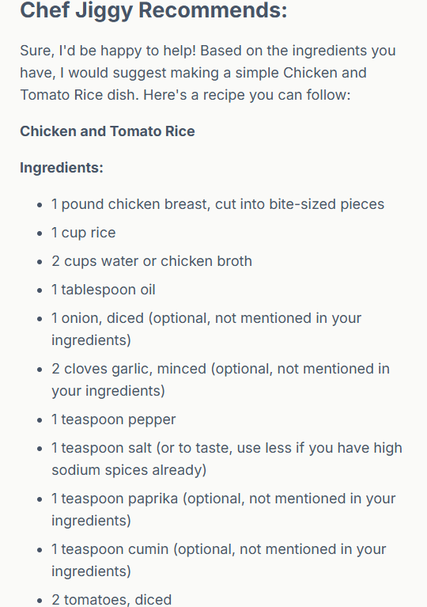
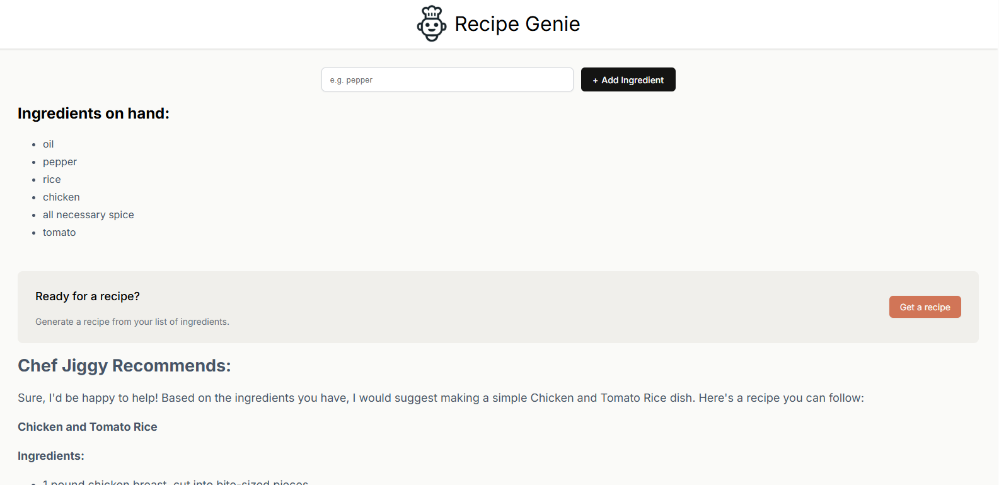

# ✨ RecipeGenie

RecipeGenie is an AI-powered cooking assistant that transforms your list of ingredients into complete recipes — including both the dish and step-by-step instructions. 🧞‍♂️🍳

---

## 🚀 Features
- Add one or multiple ingredients
- Generate a full recipe idea with AI
- Get detailed cooking instructions
- Clean, responsive design (built with CSS)
- Powered by Hugging Face Inference API
- Built with Vite for fast development

---

## 🛠️ Tech Stack
- React (Vite)
- Hugging Face Inference API
- CSS (for styling)
- Node.js

---

## ⚙️ Setup & Installation

1. Clone the repository:
   ```bash
   git clone https://github.com/YOUR_USERNAME/RecipeGenie.git
   cd RecipeGenie
2. install dependencies:
    ```bash
    npm install
3. Create a .env file in the project root:
    ```bash
    VITE_HF_ACCESS_TOKEN=your_huggingface_token
4. Start the app:
    ```bash
    npm run dev

📸 Screenshots




